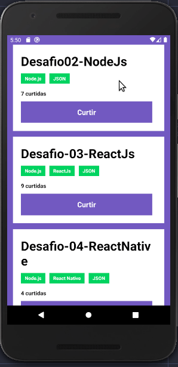
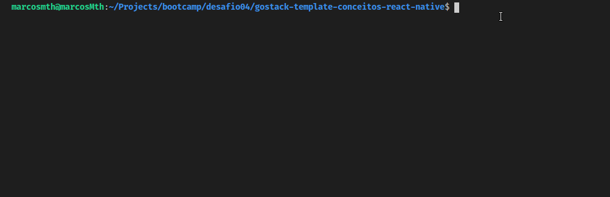

<h1>Desafio 04: Conceitos do React Native</h1>

Esse é o desafio quatro do Bootcamp da Rocketseat (turma goStack11) das aulas de React Native.

<h2>Objetivo</h2>

Fazer um front-end em React Native para dispositivos móveis, que se comunique com o back-end criado no desafio de <a href="https://github.com/MarcosMthJr/Desafio-02-Conceitos-do-Node.js">NodeJS</a> com as opções de listar e adiconar um like a um repositório.

<h3>Saída do teste automatizado</h3>

